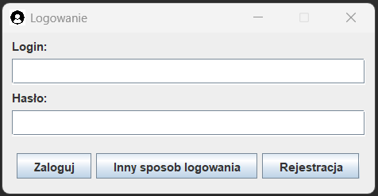
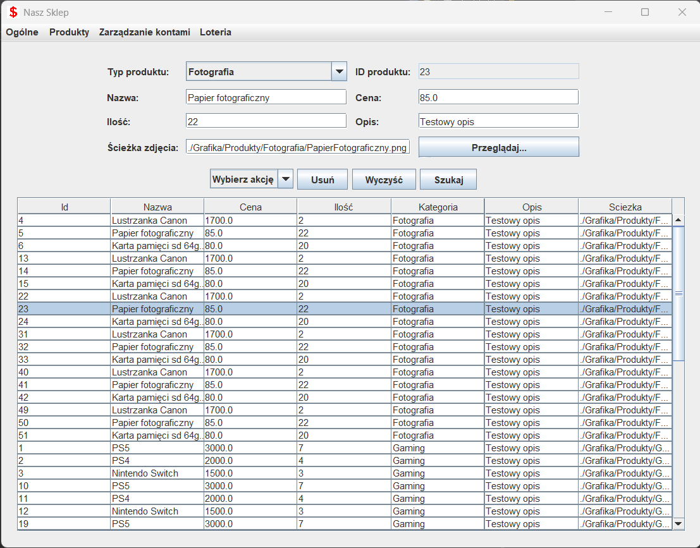
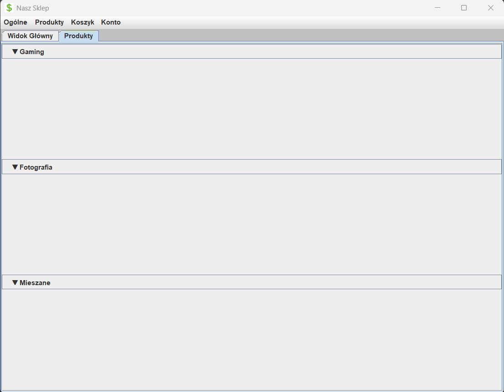

# Aplikacja sklepu – Java Swing

> Desktopowa aplikacja sklepu z systemem logowania i obsługą różnych typów kont użytkowników

---

## 🛠 Technologie

- **Java** – główny język programowania
- **Java Swing** – tworzenie graficznego interfejsu użytkownika (GUI)
- **Programowanie obiektowe (OOP)** – organizacja kodu z wykorzystaniem klas i dziedziczenia

---

## 🎯 Opis

Aplikacja została stworzona jako mini-projekt edukacyjny na Politechnice Wrocławskiej.  
Celem projektu było zaprojektowanie prostego systemu sklepowego z interfejsem graficznym, systemem logowania oraz różnymi typami użytkowników.

---

## 👥 Role użytkowników

- **Administrator** – pełen dostęp, zarządzanie kontami, dostęp do panelu admina  
- **Pracownik** – dostęp do bazy produktów, możliwość edycji  
- **Klient** – możliwość przeglądania oferty

---

## 🔐 Funkcjonalności

- System logowania i rejestracji  
- Rozpoznawanie typu konta i wyświetlanie odpowiednich opcji  
- Interfejs graficzny zbudowany na Swingu  
- Zarządzanie produktami (dodawanie, edycja, usuwanie)  
- Przykładowa baza danych przechowywana w pamięci (zapisywanie obiektów w pliki z rozszerzeniem .ser)

---

## 📷 Zrzuty ekranu
### Formularz logowania

### Zarządzanie produktami sklepu (konto administratora)

### Konto klienta (lista towarów)

---

## 👤 GitHub autorów

1. [@moshenetsb](https://github.com/moshenetsb)
2. [@Euvgene9](https://github.com/Euvgene9)
3. [@shang1410 (dawniej StudentBJ)](https://github.com/shang1410)   
4. [@zhenia0908](https://github.com/zhenia0908)
5. [@Dimoaon](https://github.com/Dimoaon)
6. [@ToriLomakova](https://github.com/ToriLomakova)  
